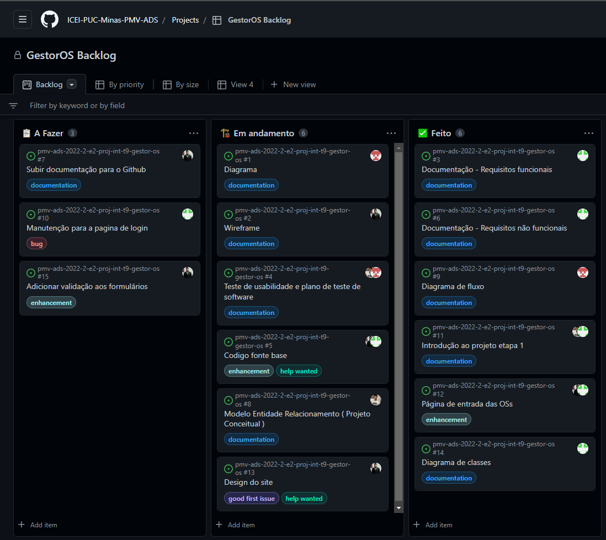

# Metodologia

Pré-requisitos: <a href="2-Especificação do Projeto.md"> Documentação de Especificação</a>

Abaixo serão apresentadas as definições do ambiente de trabalho utilizados pela  equipe para desenvolver o projeto. Abrange a relação de ambientes utilizados, a estrutura para gestão do código fonte, além da definição do processo e ferramenta através dos quais a equipe se organiza.

## Controle de Versão

A ferramenta de controle de versão adotada no projeto foi o
[Git](https://git-scm.com/), sendo que o [Github](https://github.com)
foi utilizado para hospedagem do repositório.

O projeto segue a seguinte convenção para o nome de branches:

- `main`: versão estável já testada do software
- `unstable`: versão já testada do software, porém instável
- `testing`: versão em testes do software 
- `dev`: versão de desenvolvimento do software 

Quanto à gerência de issues, o projeto adota a seguinte convenção para
etiquetas:

- `documentation`: Documentação do projeto.
- `bug`: Ocorreu um bug.
- `enhancement`: Foi aprimorado
- `feature`: Adicionar nova funcionalidade.

<strong><h3> O proximo tópico apresenta como foi feito o uso das tags: branch, merge, Master, commit e issues no projeto :</h3><strong>

<li>Foi feito duas ramificações (branchs), uma com o nome "Master" que contém o projeto na primeira versão, e um branch de testes que é derivado de Master, o "Testes".
<li>Os commits são feitos na ramificação "Testes" sem alterar o projeto original que se encontra em "Master", Para cada commit é criado uma nova versão de "Testes".
<li>Depois de feito todas as realizações de testes, O membro da equipe que está na ramificação Master poderá fazer a fusão dos dois ramos gerando uma unica versão estável do software (git merge).
<li> Gerenciamos em conjunto as issues, fazemos uma reunião e dividimos  para qual membro da equipe que irá se responsabilizar, e depois, o membro fará um commit na branch
 "Testes".
  
## Gerenciamento de Projeto
### Divisão de Papéis
A equipe está organizada da seguinte maneira:
-	<strong>Scrum Master:</strong> Eduardo Ramos
-	<strong>Product Owner:</strong> Bemvilac dos Santos.
-	<strong>Equipe de Desenvolvimento:</strong> Gabriel Vinícius; Gustavo Henrique;
- <strong>Equipe de Design:</strong> Lucas Alexandre; Guilherme Costa
## Processo : Backlog e Plano de Sprints
 
 
Tarefas são regidas pelo Scrum Master (Eduardo) e cadastradas no backlog do projeto dentro do Github, dividindo-as para cada respectivo membro da equipe responsável.. 
 As tarefas são colocadas dentro de uma <strong>sprint<strong> com duração até o final de cada etapa do projeto, cada tarefa tem status como: Andamento, a fazer e feito.  As tarefas também
 contém marcações de tipo e também qual a branch que vai ser realizada. Todos os diass a equipe faz uma pequena reunião para fazer as seguintes perguntas: "O que você fez Ontem e Hoje para ajudar a equipe na realização dos objetivos?" e alteramos o backlog conforme as informações dita nessa reunião.
   
  <strong>Backlog:</strong>
  
Link: https://github.com/orgs/ICEI-PUC-Minas-PMV-ADS/projects/129/views/1
 

### Ferramentas

As ferramentas empregadas no projeto são:

- Editor de código : Visual Studio Code 19 e Visual Studio 2022 (verão Enterprise)
- Ferramentas de comunicação : Teams, Whatsapp.
- Ferramentas de desenho de tela (_wireframing_): MockFlow.

O editor de código foi escolhido porque ele possui uma integração com o sistema de versão, bem como ser bem fácil e intuitivo o processo de atualização das novas versões criadas pela equipe de desenvolvimento. As ferramentas de comunicação utilizadas possuem integração semelhante, possibilitanto comunicação assíncrona a fim de que cada membro da equipe possa trabalhar no dia e horário que lhe for mais conveniente e fornecer anúncios do avanço produzido em tempo real.. Por fim, para criar diagramas utilizamos o MockFlow pois este se mostrou bem simples de ser atualizado e versátil para o desenvolvimento.
