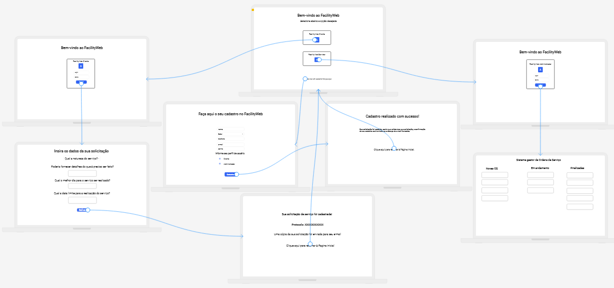
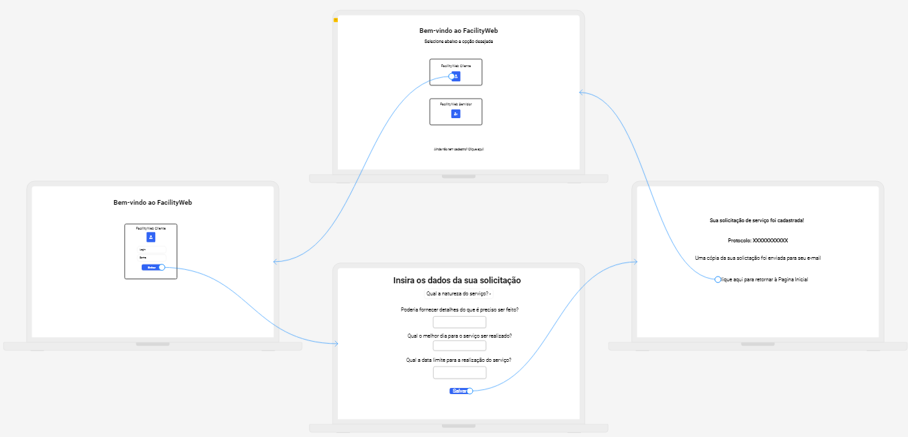

# Projeto de Interface

Pré-requisitos: <a href="2-Especificação do Projeto.md"> Documentação de Especificação</a>

Visão geral da interação do usuário pelas telas do sistema e protótipo interativo das telas com as funcionalidades que fazem parte do sistema (wireframes).

 Apresente as principais interfaces da plataforma. Discuta como ela foi elaborada de forma a atender os requisitos funcionais, não funcionais e histórias de usuário abordados nas <a href="2-Especificação do Projeto.md"> Documentação de Especificação</a>.

## Diagrama de Fluxo

O diagrama apresenta o estudo do fluxo de interação do usuário com o sistema interativo e  muitas vezes sem a necessidade do desenho do design das telas da interface. Isso permite que o design das interações seja bem planejado e gere impacto na qualidade no design do wireframe interativo que será desenvolvido logo em seguida.

O diagrama de fluxo pode ser desenvolvido com “boxes” que possuem internamente a indicação dos principais elementos de interface - tais como menus e acessos - e funcionalidades, tais como editar, pesquisar, filtrar, configurar - e a conexão entre esses boxes a partir do processo de interação. Você pode ver mais explicações e exemplos https://www.lucidchart.com/blog/how-to-make-a-user-flow-diagram.

As referências abaixo irão auxiliá-lo na geração do artefato “Diagramas de Fluxo”.

> **Links Úteis**:
> - [Fluxograma online: seis sites para fazer gráfico sem instalar nada | Produtividade | TechTudo](https://www.techtudo.com.br/listas/2019/03/fluxograma-online-seis-sites-para-fazer-grafico-sem-instalar-nada.ghtml)

## Wireframes

Nesta seção apresentamos o wireframe do projeto, como protótipo das telas da aplicação, bem como relacionamento entre elas. Em um primeiro momento, veremos o projeto em sua totalidade, para, em seguida, nos aprofundar em cada função do sistema de gerenciamento de ordens de serviço.

Como podemos ver, na página inicial já se encontram disponíveis as três funcionalidades para o usuário: a opção de ir para o ambiente do cliente do serviço do setor de facilities da empresa, a opção de seguir como administrador (o responsável por cumprir as ordens de serviço emanadas pelo cliente), bem como a oportunidade de criar seu cadastro no sistema, caso seja um novo usuário. A serguir, debruçaremos sobre cada funcionalidade em separado.

Começando pelo ambiente do cliente, após selecionar a opção "cliente" na página inicial, o usuário será levado a um ambiente de login, no qual estrará com seus dados de acesso. Após isso, será disponibilidade uma tela para que sejam fornecidas as informações acerca do serviço a ser realizado: 
> <ul>
> <il>- Natureza do serviço a ser realizado;</il> 
> <il>- Opção para fornecer detalhes sobre a solicitação;</il> 
> <il>- Opção para selecionar o melhor dia para o serviço ser realizado;</il> 
> <il>- Campo para definir a data limite para o serviço ser realizado, caso a data ideal não possa ser atendida.</il> 
> </ul>
Por fim, ao salvar a ordem de serviço, o usuário será direcionado para uma nova tela de confirmação de solicitação de serviço, contendo o protocolo da ordem de serviço gerada. Essa funcionalidade, contudo, poderá ser substituída por um pop-up.

> **Links Úteis**:
> - [Protótipos vs Wireframes](https://www.nngroup.com/videos/prototypes-vs-wireframes-ux-projects/)
> - [Ferramentas de Wireframes](https://rockcontent.com/blog/wireframes/)
> - [MarvelApp](https://marvelapp.com/developers/documentation/tutorials/)
> - [Figma](https://www.figma.com/)
> - [Adobe XD](https://www.adobe.com/br/products/xd.html#scroll)
> - [Axure](https://www.axure.com/edu) (Licença Educacional)
> - [InvisionApp](https://www.invisionapp.com/) (Licença Educacional)
