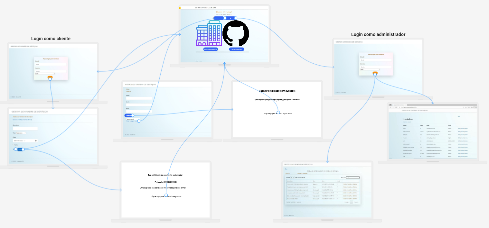
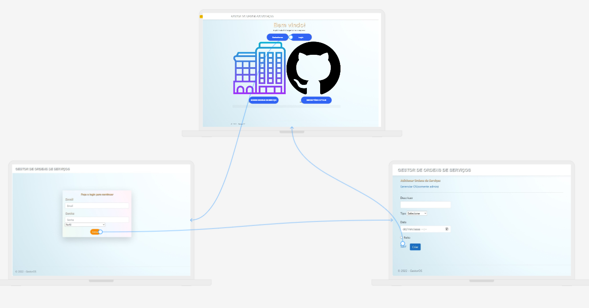
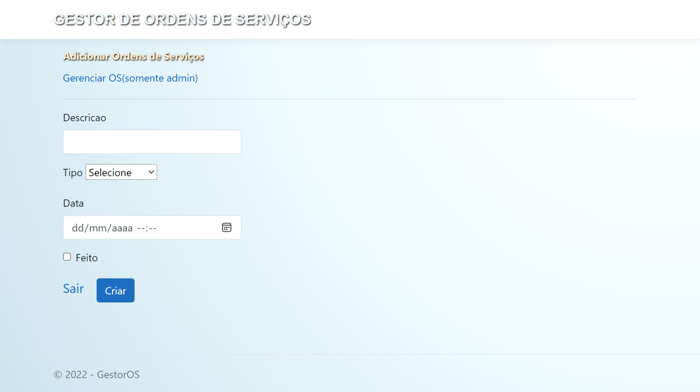
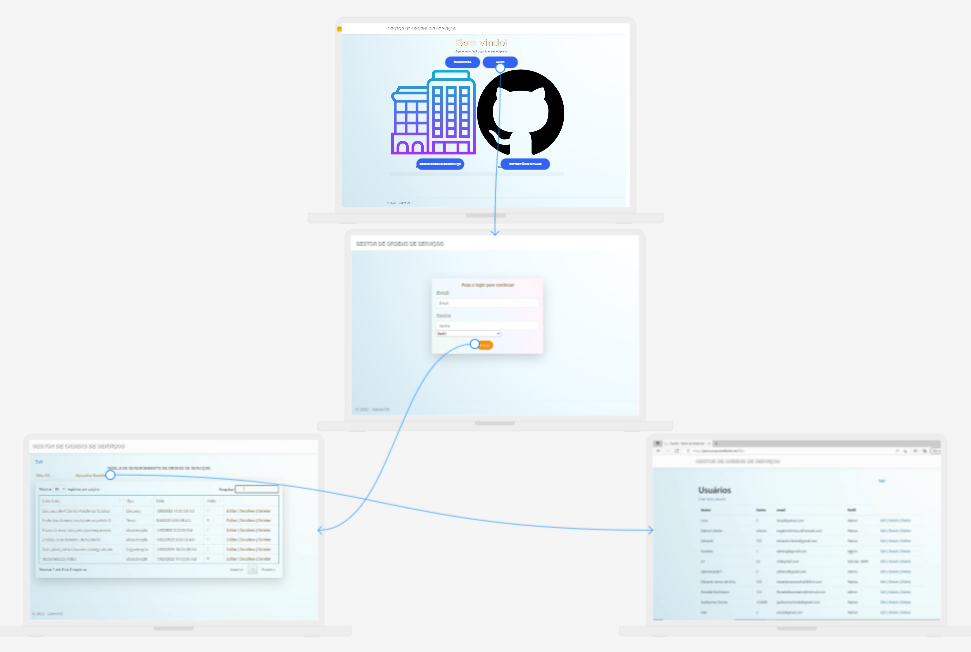
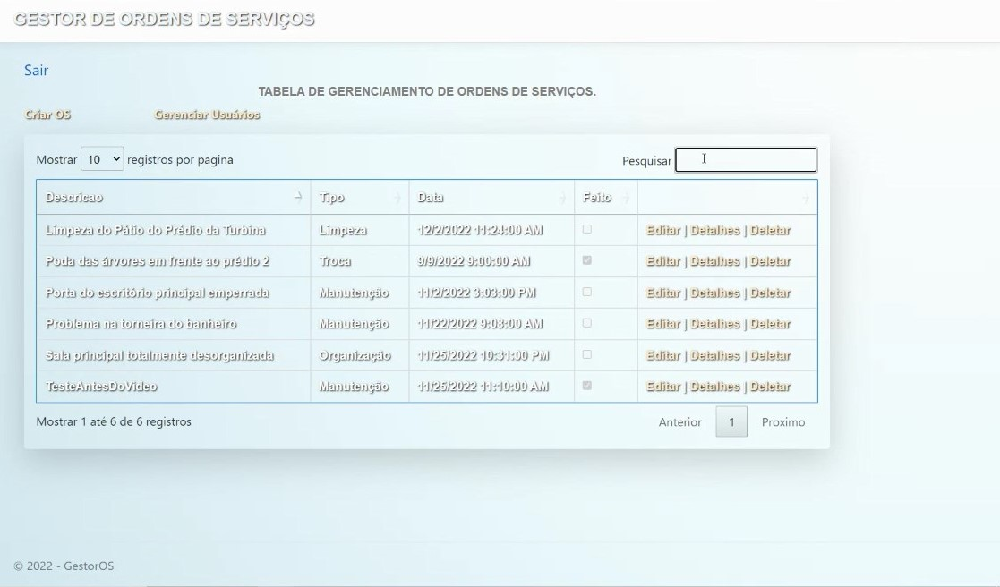
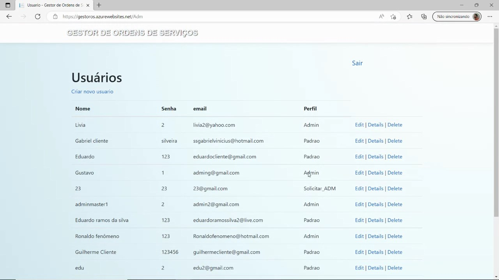
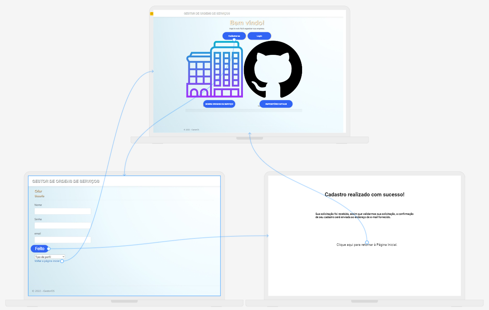

# Projeto de Interface

Pré-requisitos: <a href="2-Especificação do Projeto.md"> Documentação de Especificação</a>

Visão geral da interação do usuário pelas telas do sistema e protótipo interativo das telas com as funcionalidades que fazem parte do sistema (wireframes).

## Diagrama de Fluxo

Um diagrama de fluxo de dados (DFD) mapeia o fluxo de informações para qualquer processo ou sistema. Ele utiliza símbolos definidos, como retângulos, círculos e flechas, além de rótulos de textos breves, para mostrar entradas e saídas de dados, pontos de armazenamento e as rotas entre cada destino.
Aqui segue o diagrama de fluxo da aplicação:

As referências abaixo irão auxiliá-lo na geração do artefato “Diagramas de Fluxo”.

> **Links Úteis**:
> - [Fluxograma online: seis sites para fazer gráfico sem instalar nada | Produtividade | TechTudo](https://www.techtudo.com.br/listas/2019/03/fluxograma-online-seis-sites-para-fazer-grafico-sem-instalar-nada.ghtml)

## Wireframes

Nesta seção, utilizando a ferramenta Uizard, disponível em <a href="https://app.uizard.io/">https://app.uizard.io/</a>, apresentamos o wireframe do projeto, como protótipo das telas da aplicação, bem como relacionamento entre elas. Em um primeiro momento, veremos o projeto em sua totalidade, para, em seguida, nos aprofundar em cada função do sistema de gerenciamento de ordens de serviço. No final, oferecemos uma oportunidade para visualizar o projeto em uma visualização interativa.

Como podemos ver, na página inicial já se encontram disponíveis as três funcionalidades para o usuário: Na opção de login, insere-se as informações do usuário e seleciona-se o perfil (se cliente ou administrador); também é possível cadastrar um novo usuário A serguir, debruçaremos sobre cada funcionalidade em separado.

  
<strong>Ambiente do Cliente</strong>

Realizando o login como cliente, o usuário será levado a um ambiente onde estará disponibilidade uma tela para que sejam fornecidas as informações acerca do serviço a ser realizado: 
> <ul>
> <il>- Natureza do serviço a ser realizado;</il> 
> <il>- Opção para fornecer detalhes sobre a solicitação;</il> 
> <il>- Opção para selecionar o melhor dia para o serviço ser realizado;</il> 
> <il>- Campo para definir a data limite para o serviço ser realizado, caso a data ideal não possa ser atendida.</il> 
> </ul>
Por fim, ao salvar a ordem de serviço, o usuário receberá uma notificação em sua tela, do tipo "alert", com a confirmação sa solicitação de serviço, contendo o protocolo da ordem de serviço gerada.

  
<strong>Ambiente do Administrador</strong>

Já no ambiente do administrador, após realizar o login com esse perfil, o administrador terá disponível uma tela em que poderá ver as novas ordens de serviço geradas pelos clientes, bem como quais serviços estão em andamento, e os trabalhos que já foram finalizados, de modo que poderá acompanhar o desempenho e emprego da equipe.

  
<strong>Ambiente do Novo Usuário</strong>

Caso seja um novo usuário do sistema de gerenciamento de ordens de serviço, na página inicial da aplicação terá uma opção para realizar seu cadastro. Após selecionar essa opção, o usuário será direcionado para um abiente no qual ele irá fornecer informações a seu respeito, tais como:

> <ul>
> <il>- Nome;</il> 
> <il>- E-mail;</il> 
> <il>- Senha;</il> 
> <il>- Tipo de perfil de usuário: cliente ou administrador.</il> 
> </ul>

Se for selecionado criar um novo usuário com perfil de administrador, esse dependerá de aprovação de um usuário que já seja administrador do sistema.

Conforme dito no inicio desta seção, para melhor compreensão e visualização, oferecemos uma versão interativa, <a href="https://app.uizard.io/p/c54734e5">basta clicar aqui!</a>
