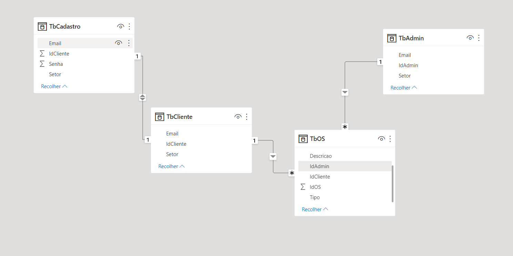

# Arquitetura da Solução

## Modelo Entidade Relacionamento

O modelo Entidade Relacionamento faz o vínculo entres os fatos do negócio (no caso do presente trabalho, as Ordens de Serviço [OS]) e suas caracteristicas (Dimensões). Cada objeto (Entidade) gera ou participa de eventos que devem ser pontuados segundo seus atributos. A ponte entre Objeto e Atributo é dado pelo nível de relacionamento entre eles, sua granularidade além de sua cardinalidade (Relação)
Segue figura demonstrativa do nível conceitual do Banco de Dados do corrente Projeto

Cada Objeto no Banco de Dados será um entidade física, a Tabela, enquanto as relações são dadas pelas linhas que vinculam as Chaves Primárias (Atributos distintos e únicos na linha da tabela). Completando assim o Projeto de Banco de Dados, como demonstrado na figura abaixo:
## Projeto da Base de Dados

## Tecnologias Utilizadas

Neste projeto utilizamos tecnologias de desenvolvimento Front-End, tais como HTML5 para escrever o corpo da página web em que se baseia a solução. Para estilizar as páginas html e deixar a interface mais agradável ao usuário foram implementadas páginas de estilo baseadas em CSS3. Por fim, foi utilizado um código em C# para criar o banco de dados que irá gerenciar os usuários cadastrados (clientes e administradores) bem como as ordens de serviço geradas.
.

## Hospedagem

Nesse primeiro momento de desenvolvimento, a aplicação utilizará a plataforma do GitHub Pages como ambiente de hospedagem devido a facilidade de uso e atualização com as mudanças que serão implementadas com o decorrer do projeto.

> **Links Úteis**:
>
> - [Website com GitHub Pages](https://pages.github.com/)
> - [Programação colaborativa com Repl.it](https://repl.it/)
> - [Getting Started with Heroku](https://devcenter.heroku.com/start)
> - [Publicando Seu Site No Heroku](http://pythonclub.com.br/publicando-seu-hello-world-no-heroku.html)
