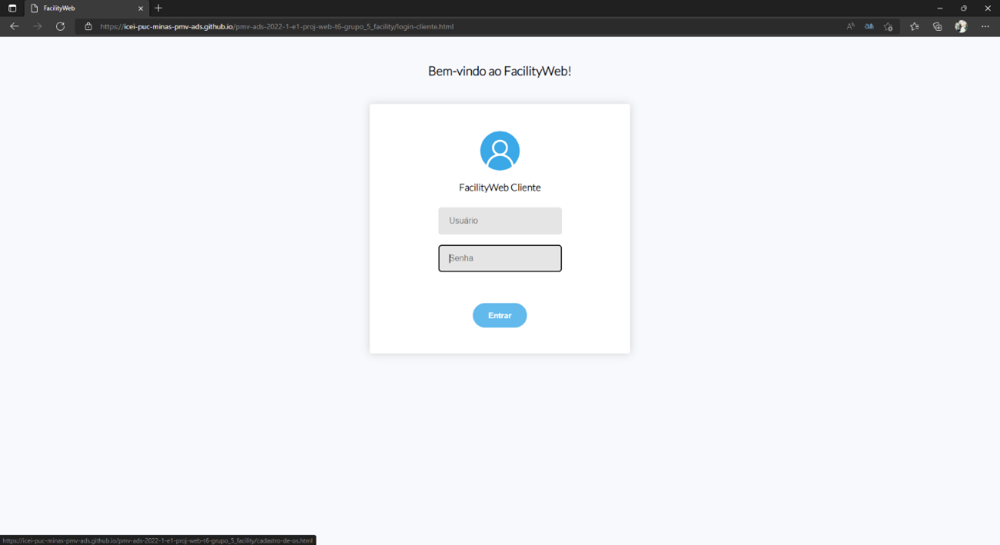
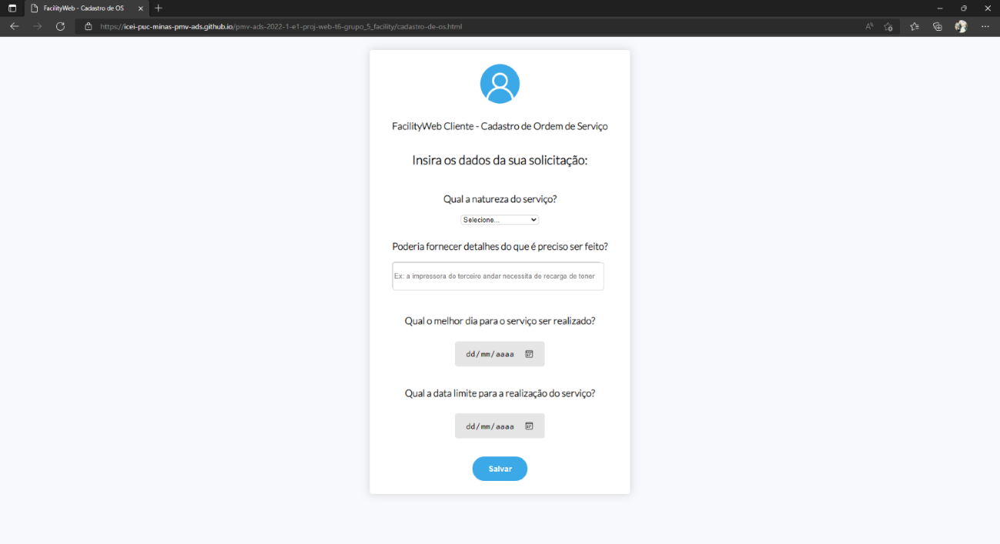
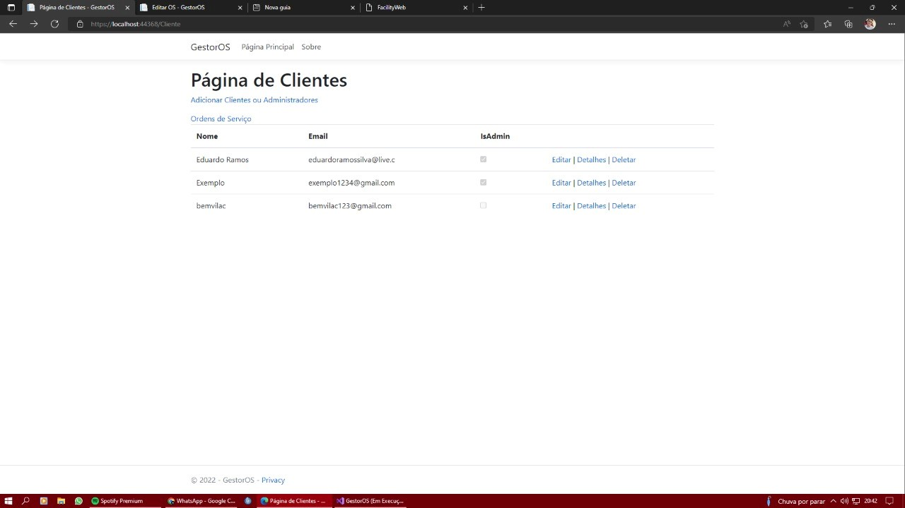
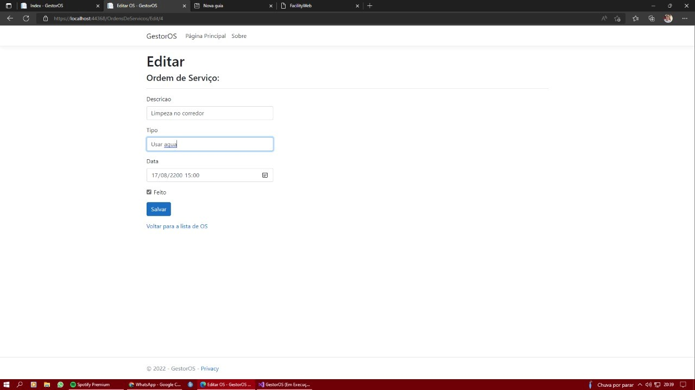
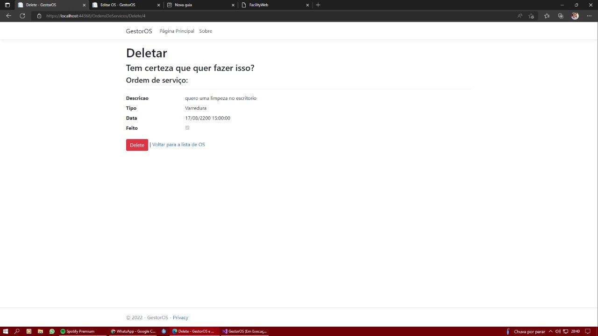

## Avaliação

Discorra sobre os resultados do teste. Ressaltando pontos fortes e fracos identificados na solução. Comente como o grupo pretende atacar esses pontos nas próximas iterações. Apresente as falhas detectadas e as melhorias geradas a partir dos resultados obtidos nos testes.
# Registro de Testes de Software

Resultado CT-01- Visualizar tela de login:

Resultado CT-02- Visualizar página de cadastro de OS:

Resultado CT-03- Visualizar página de Gerenciamento de OS:

Resultado CT-04- Visualizar página de Alterar solicitação:

Resultado CT-05- Visualizar página de Deletar solicitação:

