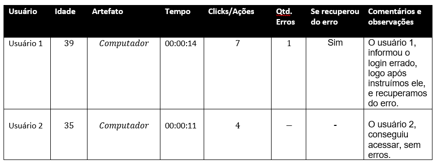

# Plano de Testes de Usabilidade

O objetivo desse teste é receber o feedback do usuário, certificando se o site entrega o esperado e funciona corretamente. Serão 5 (cinco) participantes. O procedimento no qual conduziremos o teste será remotamente via acesso de nosso ambiente sandbox. O método escolhido será por avaliação, o usuário nos informará sua experiência com o aplicativo em artefatos-chave. Criamos 3 (tres) tarefas a serem cumpridas pelos candidatos, as quais estão ligadas aos requisitos funcionais abaixo descritos:     

## Objetivo 

> Decidiu-se no plano de usabilidade dar foco a controles-chave (críticos) para a interface do aplicativo. E nos quais haja maior possibilidade tanto de erro de programação quanto de intuitivade no uso para o usuário final, como se segue abaixo:

|ID    | Descrição do Requisito  | Objetivo
|------|-----------------------------------------|
|RF-001| A aplicação deverá apresentar uma tela onde o usuário poderá fazer login com "Email" e "Senha". | Verificar se os campos senha e login estão codificados de maneira a rotear corretamente o usuário para a tela determinada: se clinte, criação das OS's, se administrador, para a tela de gestão das OS's |
|RF-002| A aplicação deverá apresentar uma tela onde o cliente poderá fazer a solicitação de OS. Com campos para informar o escopo da requisição tais como: descrição, tipo, data e hora desejada para realização da demanda. | Verificar se o controle de seleção de data esta codificado corretamente e intuitivo |
|RF-003| A aplicação deverá exibir uma tela de controle das solicitações feitas, a fim de poder alterar, editar, excluir e criar ordens de serviço  |  Verificar se o controle de conclusão da OS esta corretamente codificado

Iremos acompanhar, coletar dados e registrar a métrica. 

# Registros de Testes de Usabilidade
Os resultados obtidos nos testes de usabilidade realizados são descritos nas Tabelas a seguir:

CT-01 Efetuar o login

CT-02 Cadastrar solicitaçãod e OS

CT-03 Ver detalhes da solicitação

CT-04 Deletar solicitação

