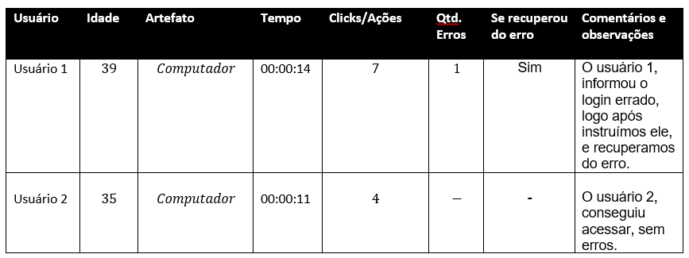
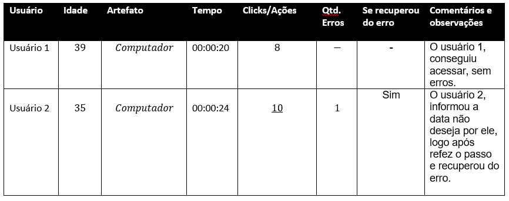
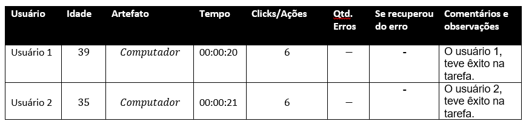
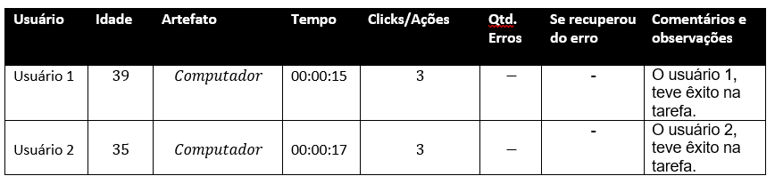

# Plano de Testes de Usabilidade

O objetivo desse teste é receber o feedback do usuário, certificando se o site entrega o esperado e funciona corretamente. Haverá dois participantes eles foram escolhidos por fazerem parte do Facility e necessitarem dessa solicitação. O procedimento no qual conduziremos o teste será remotamente. O método escolhido será por avaliação, o usuário nos informará sua experiência com a API que ressaltará o resultado positivo ou negativo. Criamos quatro tarefas a serem cumpridas pelos candidatos, a ordem das tarefas será o seguinte:     

1- Fazer login.  
2- Cadastrar OS.  
3- Alterar solicitação. 
4- Deletar solicitação.  
Iremos acompanhar, coletar dados e registrar a métrica. 

# Registros de Testes de Usabilidade
Os resultados obtidos nos testes de usabilidade realizados são descritos nas Tabelas a seguir:

CT-01 Efetuar o login

CT-02 Cadastrar solicitaçãod e OS

CT-03 Ver detalhes da solicitação

CT-04 Deletar solicitação

